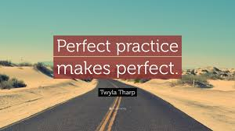

# My timeline
## First of all, thank you so much for watching my website

# About me
### 1. About me
#### I am Cao Thi Anh Dao. Currently, I'm senior student in Da Nang University of Technology.As you know or you dont know, my major is Information Technology. One of more my hobbies is coding, I want to create amazing thing that I wanted. Another, I really like watching Youtube. By the way, I can pratice to listen English when I watch. My goal is become international person. So, I try to learn English language. Because, I know, You know English language, you know success.
### 2. My technical skill: Web developer
### 3. Try to learning English Writing.
####  This website is where I can pratice writing by English Language. If you are reading that you meet my mistake, feel free, because I'm just beginer. So, my slogan is "try to meet mistake, try to be success".

##### ⋅⋅⋅It have two reason why I try to learning English Writing. First reasion, I want to work in international company. So, I have to more skill about writing to explain with coleage and customer. Because, my company in Viet Nam, maybe our customer is in outside. More than, my coleage come from many country. And we comunicate together by English Language.

## * Don't fraid of failure
## - Don't fraid of mistake
## + Become confident person

# Timeline
* October, 2018.
[12/10/2018](manageyourtime.md)
[13/10/2018](become-confident-perspm.md)
* November, 2018.
[12/11/2018](https://www.google.com)
[12/11/2018](https://www.google.com)
