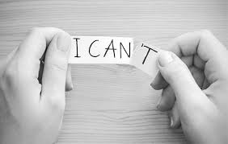

# Become Confident PerSon

Confidence is a key part of being successfull in almost any situation. It's especially importent when it come to your professional life. 
One of the areas where confidence really matters is public speaking. 
Unfortunately, a lot of people are afraid of public speaking (including seasoned professiona(). 
If you're among them, don't worry. With a little bit of practice and preparation, you can conquer your fear and learn how to deliver a powerful and angaging speech.
Here are five tips for becoming a confident public speaker.
* Have a positive attitude
Being able to get your message across effectively start with having a positive attitude. Although this may seem difficult if you re feeling nervous, it's actually not as hard as it sound.
The key is to know your goal anf to tell yourself that you you can do it. 
For example, if your goal is to present a new strategy to the entire company, reminding yourself that you have knowledge and the skill to deliver a great speech is crucial to your success. 
This will help boost your confidence and ensure that you stay positive as you get closer to giving your presentation. 
*Know what you want to communicate
Along with building confidence, knowing what you want to communicate is a ket component of successfull public speaking. The best way to do this is by coming up with a list of 2-3 bullet points that you condiser to be the key take awats of your speech. 
Then craft your speech with these in mind and practice it several times to ensure that you're emphasizing these points as effectively as possible.
# Clear your mind
Once you have  your speech prepared and you've visualized a successfull outcome. The next steop is being able to clear your mind right before your speech. There are several ways to do this but the most effective is to practive some deep breathing. This works best if done right before the speech. Spend a few minutes breathing in and out slowly and focusing on your breath. This will help clear your mind od any remaining anxiety and will ensure that yuor mind and body are relaxed as you prepare to start your speech.
# Connect with the audience
Along with being calm and prepares, one od the keys to giving a successfull speech is being able to connect with your audience. The best way to do this is by making regular eye contact during your speech and by asking question designed to engage your listeners. 
###### Pro Tip:  A great way to preatice sonnecting with your audience is by rehearsing your speech in front of friends. This will ensure that you're comfortable with the delivery anf able to focus on enfafing with your audience.
#### Public speaking is a great skill to have in any professional context and it;s especially impressive for recent grads who are just establishing themselves in ther careers. By following these tips and growing your self-confidence. You will able to become a confident public speaker and to impress current and future enmployer along the way.
