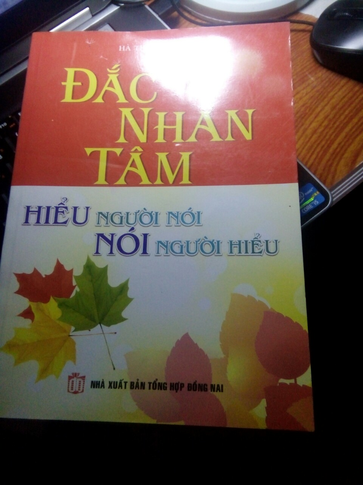

# Maintain Habit Reading Book
###### 6/10/2018
# Why I want to write this content? 
+ First of all, I really like book, especially book about mentality.
+ Today, I am upset because I have to leave my  book. In the future, I make suse that I will buy it again. I want to keep a little memory about these book in here. :(((
### Some pictures 

The most successfull people in the world make time to read, study and learn  far beyond their grade school years. In turn, they're better thinkers, innovators and leaders.
With infinite knowledge from books, we can improve so much about every thing in our life. Perhaps we can challege ourselves to read book every day.
## List 10 benifit of reading book
##### 1. Metal Stimulation: 
Just like any other muscle in the body, the brain require exercice to keep it strong and healthy.
Reading like chess or do puzzles. It have also been found to be helpful with cognitive stimulation.
##### 2. Stress Reduction: 
How much stress you have at university, at work, in your personal relationship or countless other issues faced in daily life? 

No matter, don't worry. It all just slips away when you lose yourself in a great story.  A well book tranport you to other realms, distract you and keep you in the present moment, letting tensions drain away and  allowing you to relax. 
##### 3. Knowledge: 

Everything you read fills your head with new bits of information, and you never know when it might come in handy. The more knowledge you have, the better-equipped you are to tackle any challenge you'll ever face.

Additionally, here;s a bit of food for thought:  should you ever find yourself in dire circumstances, rememver that althoufh you might lose everything else - your job, your possessions, your money, even your heath- knowlegde can never be taken from you.
##### 4. Vocabulary Expansion: 

The more you read, the more words you gain ecposure to, anf they'll inevitably maike theri way into  your veryday vocabulary. 
Being articulate and well-spoken is of great help in any profession, and knowing that you can speak to higher-ups with self-confidence can be an enormous boost to  your self-esteem.

IT could even aid in your career, as those who are will-read, well-speken and knowledgeeable on a variety of topics tend to get promotions more quickly and more often than those with smaller vocabularies and lack of awareness od literature, scientific breakthroughts and global events.
##### 5. Memory Improvement: 

When you read a book, you have to remember an assortment of characters, their backgrounds, ambitions, history, and nuances, as well as the various arcs and sub-plots that weave their way through every story. That’s a fair bit to remember, but brains are marvellous things and can remember these things with relative ease.

Amazingly enough, every new memory you create forges new synapses (brain pathways)[3] and strengthens existing ones, which assists in short-term memory recall as well as stabilizing moods.

##### 6. Stronger Analytical Thinking Skills

Have you ever read an amazing mystery novel, and solved the mystery yourself before finishing the book? If so, you were able to put critical and analytical thinking to work by taking note of all the details provided and sorting them out to determine “whodunnit”.

That same ability to analyze details also comes in handy when it comes to critiquing the plot; determining whether it was a well-written piece, if the characters were properly developed, if the storyline ran smoothly, etc.
Should you ever have an opportunity to discuss the book with others, you’ll be able to state your opinions clearly, as you’ve taken the time to really consider all the aspects involved.

##### 7. Improved Focus and Concentration

In our internet-crazed world, attention is drawn in a million different directions at once as we multi-task through every day.
In a single 5-minute span, the average person will divide their time between working on a task, checking email, chatting with a couple of people (via gchat, skype, etc.), keeping an eye on twitter, monitoring their smartphone, and interacting with co-workers. This type of ADD-like behaviour causes stress levels to rise, and lowers our productivity.

When you read a book, all of your attention is focused on the story—the rest of the world just falls away, and you can immerse yourself in every fine detail you’re absorbing.

Try reading for 15-20 minutes before work (i.e. on your morning commute, if you take public transit), and you’ll be surprised at how much more focused you are once you get to the office.

##### 8. Better Writing Skills

This goes hand-in-hand with the expansion of your vocabulary:
Exposure to published, well-written work has a noted effect on one’s own writing, as observing the cadence, fluidity, and writing styles of other authors will invariably influence your own work.

In the same way that musicians influence one another and painters use techniques established by previous masters, so do writers learn how to craft prose by reading the works of others.

##### 9. Tranquility

In addition to the relaxation that accompanies reading a good book, it’s possible that the subject you read about can bring about immense inner peace and tranquility.

Reading spiritual texts can lower blood pressure and bring about an immense sense of calm, while reading self-help books has been shown to help people suffering from certain mood disorders and mild mental illnesses.=

##### 10. Free Entertainment

Though many of us like to buy books so we can annotate them and dog-ear pages for future reference, they can be quite pricey.
For low-budget entertainment, you can visit your local library and bask in the glory of the countless tomes available there for free. Libraries have books on every subject imaginable, and since they rotate their stock and constantly get new books, you’ll never run out of reading materials.

If you happen to live in an area that doesn’t have a local library, or if you’re mobility-impaired and can’t get to one easily, most libraries have their books available in PDF or ePub format so you can read them on your e-reader, iPad, or your computer screen.
There are also many sources online where you can download free e-books, so go hunting for something new to read!

There’s a reading genre for every literate person on the planet, and whether your tastes lie in classical literature, poetry, fashion magazines, biographies, religious texts, young adult books, self-help guides, street lit, or romance novels, there’s something out there to capture your curiosity and imagination.

Step away from your computer for a little while, crack open a book, and replenish your soul for a little while.

##Continue

