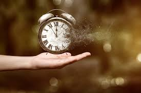

# Manage Your Time

Firt of all, I think that everyone have same times, but they use it differently. So, one of them become success person and more person waste the time they have, and then they become failure person.
By the way, You are success or failue? It depends on how to you use time.
Let me discover how to manage your time. Let's started!
We discuss about 15 tip help you manage your time better.
The first stage of improving your time management is to list absolutely everything that you have to do. 
This may sound obvios, but as I know from experience, most students tend to leave important task until the last minute, which can impact on the quality of their work.
More impotant is create life Schedule. A timetable or a calendar on your phone or another an organizing tool that works well for you anf add list of priorities to it. 
There are many time management apps that can help with this. Also make sure that you get enough sleep. Most people need between 7 to 8 hours sleep every night.
## 1. Set goals and rewards
You can create proper targets and you wont fall off schedule.  However, before you decide your objectives, you have to see deeply inside and ask yourself if you want to achieve those things. It help you to see the bigger picture and help you do as many things as possible 
 in your 24 hours.
## 2. Prioritize Your tasks
 Sometime, You cann't do everything or you dont have enought time to do it. That why it's important to set your priorities right.
## 3.. Continue...
